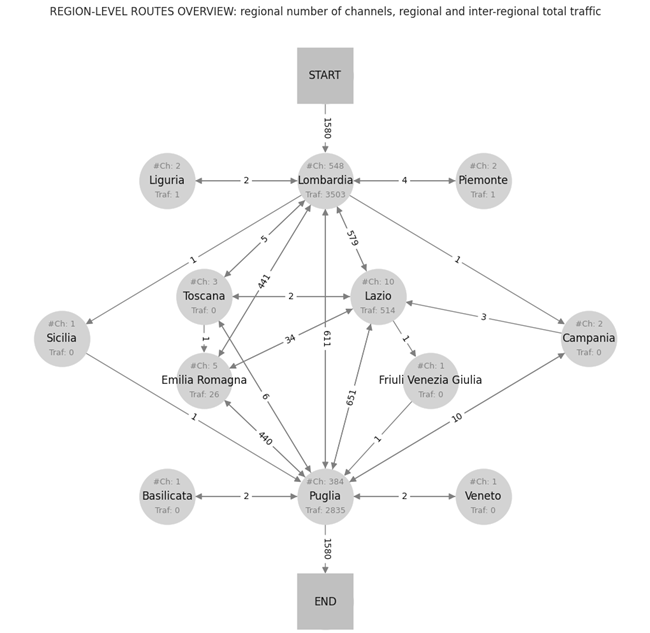

# AI-fostered Graph Analysis:

## Network Clustering and Representation Learning

### Implementation in a business context

#### Abstract

Nowadays, information sets of various types are increasingly often conceivable in graph form: for implementations in disparate fields, data mining is substantially based on social networks, Internet of Things, and similar technologies characterized by a highly spread interconnectivity. Moreover, even when information sources are not intrinsically scattered, the graph-encryption of correlation features gets useful in many contexts to efficiently analyze huge data amounts.

Another consistent and renowned characteristic of the digital era is indeed the increasing trend in data quantities. The latter are physiologically produced as always more daily actions are accomplished at least indirectly exploiting some electronic device; however, the same information volumes must also be properly stored and – most importantly despite less intuitively – very wisely processed in order to derive any type of related benefit.

Since the wide network paradigm is pressingly invading the data-driven environment we technically live in, Machine Learning is eccentrically definable as the complementary element integrating a hopefully virtuous circle. In fact, AI algorithms are both fundamental tools for interconnected metadata creation (e.g., enabling text and speech mining) and principal solutions to obtain value from overwhelming information amounts. Nevertheless, ML’s specific adaptability to graph analysis tasks is still not a fully examined issue at all.

Therefore, the present [paper](AI_fostered_Graph_Analysis.pdf) aims to summarize the current state of the art on the subject of networks study via Artificial Intelligence techniques, with particular reference to graph clustering and representation learning algorithms. Illustrative strategies of the main different types are discussed and compared through academic papers review; subsequently, the same methods are put at cooperation in [analyzing](AI_fostered_Graph_Analysis.ipynb) a delivery-logistic sub-graph granted by Poste Italiane, to better consider AI instruments’ mastery in examining process-related networks.

